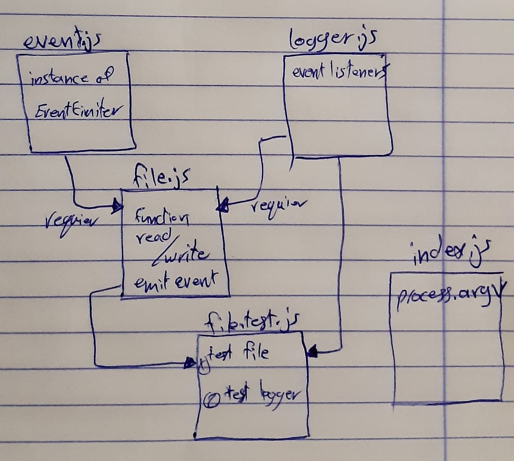

# Event Driven Applications

# LAB - Class 016

### Author: Ahmad Sawalqeh

### Links and Resources

- [submission PR](https://github.com/Ahmad-Sawalqeh/event-driven-app/pull/1)
- [ci/cd](https://github.com/Ahmad-Sawalqeh/event-driven-app/runs/435028659?check_suite_focus=true) (GitHub Actions)

### Setup
run `npm i`

#### How to initialize/run your application (where applicable)
run `npm test` to check all test.

#### Tests

- How do you run tests? 
  run `npm test`

# UML

